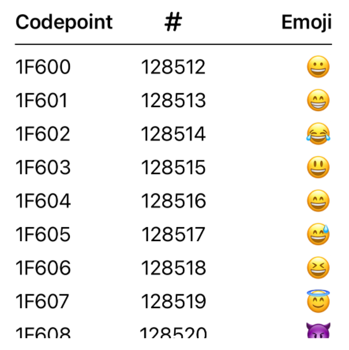

# SwiftTableView

**SwiftTableView** allows you to easily create table views in SwiftUI. It is based on [SequenceBuilder](https://github.com/andtie/SequenceBuilder).

Example:
```swift
import SwiftTableView

let numbers = (0...79).map { $0 + 0x1f600 }

Table(rows: numbers.count) {
    Column { Text(String(format: "%02X", numbers[$0])) }
        .title("Codepoint")
        .alignment(.leading)
    Column { Text(String(numbers[$0])) }
        .header(Image(systemName: "number"))
        .alignment(.center)
    Column { Text(String(Character(UnicodeScalar(numbers[$0])!))) }
        .title("Emoji")
        .alignment(.trailing)
}
```



You can style the table by defining a `TableStyle`:
```swift
public struct DefaultTableStyle<Header: View, Cell: View>: TableStyle {
    public init() {}

    public func makeBody(configuration: TableStyleConfiguration<Header, Cell>) -> some View {
        VStack {
            LazyVGrid(columns: configuration.gridItems) {
                ForEach(0..<configuration.columns, id: \.self) { column in
                    configuration.header(column: column)
                }
            }
            .font(.headline)
            Color(UIColor.label).frame(height: 1)
            ScrollView {
                LazyVGrid(columns: configuration.gridItems, spacing: 8) {
                    ForEach(0..<configuration.rows, id: \.self) { row in
                        ForEach(0..<configuration.columns, id: \.self) { column in
                            configuration.cell(column: column, row: row)
                        }
                    }
                }
            }
        }
    }
}

// Usage: Table(rows: numbers.count) { … }.tableStyle(DefaultTableStyle())
```

## Installation

### Swift Package Manager

In Xcode, select menu `File > Swift Packages > Add Package Dependency...` and enter the repository URL.
```
Repository: "https://github.com/andtie/SwiftTableView"
```
